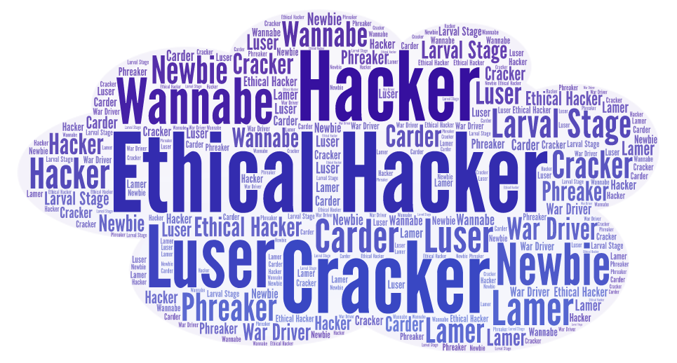
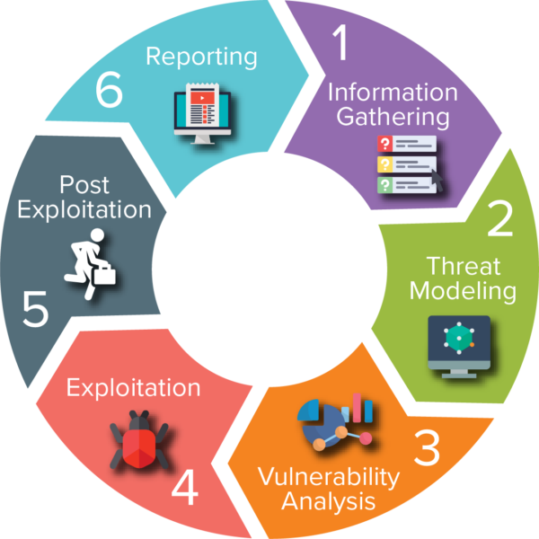

PenTest: Técnicas de Intrusão em Redes Corporativas
===================================================

> **"A penatration test is a snapshot of the current security posture."** Lee Allen (Autor de _Advanced Penetration Testing for Highly-Secured Environments_)

Repositório Criado para armazemento de informações gerais do curso de PenTest.

Tree - Árvore de Diretórios
----
```


```

Vagrant
-----------
O [Vagrant](https://www.vagrantup.com/), de forma geral, é uma aplicação de cria e gerencia ambientes virtualizados, baseado em providers (Virtualbox, VMWare, etc) e provisions (Shell, Ansible, Puppet, etc).

Por isso, iremos utiliza-lo para criar a infraestrutura do Laboratório deste curso. E para isso já temos preparado um Vagrantfile, arquivo que contém a infraestrutura baseada em codigo.

* [Vagrantfile](https://github.com/yesquines/PenTest/blob/master/Vagrantfile)

Este ambiente é contruirá uma máquina com [Kali Linux](https://www.kali.org/) e duas máquinas [Metasploitable3](https://github.com/rapid7/metasploitable3) (Mantida pela Rapid7), sendo uma Linux - Ubuntu 14.04 - e uma Windows Server 2008.

### Procedimento para Inicializar a infraestrutura
```bash
git clone https://github.com/yesquines/PenTest.git pentest_lab
cd pentest_lab
vagrant up
```
> OBS¹: É recomendado no minimo 8Gb RAM para utilização desse Laboratório.

> OBS²: O tamanho das boxes, imagens utilizadas pelo vagrant, são relativamento grandes, sendo assim o procedimento de inicialização pode demorar.

### Vagrant - Comandos Básicos

Comandos     | Descrição
------------ |------------------
vagrant init| Gera o VagrantFile
vagrant box add <box> | Baixar imagem do sistema
vagrant box status    | Verificar o status dos boxes criados
vagrant up            | Cria/Liga as VMs baseado no VagrantFile
vagrant up --provision| Sobe a máquina com as alterações feitas no VagrantFile
vagrant provision     | Provisiona mudanças logicas nas VMs
vagrant status | Verifica se VM estão ativas ou não.
vagrant ssh 'vm'  | Acessa a VM
vagrant ssh 'vm' -c 'comando' | Executa comando via ssh
vagrant reload 'vm' | Reinicia a VM
vagrant halt  | Desliga as VMs

Introdução
----------

### Hacker vs Ethical Hacker



o termo Hacker, atualmente, é mal interpretado já que a explicação popular está associado a criminosos digitais.

Mas o conceito de **Hacker** é totalmente diferente, fazendo referencia a individuos com _habilidades técnicas_ geralmente voltadas para o munda da técnologia (programaçao, sistemas operacionais, etc) que atuam com um _código de ética_ focado em não usar suas habilidades para o mal, com isso, o conceito avesso a este deveria ser denominado de **Cracker**

Porém como os termo Hacker ficou popular, foi necessário separar os lados entre aqueles que tem um pensamento ético e os que não tem, nascendo assim o termo **Ethical Hacker**.

Sendo assim, fica claro que a maior diferença entre um Hacker não ético/Cracker e um Ethical Hacker é sua indole, já que essa será a sua base da forma que ele utilizará seu conhecimento, para o bem ou para o mal.

Além, disso, para o mundo corporativo, é comum apontar o Ethical Hacker como sendo um individuo que é _contratado_ para identificar e analisar vulnerabilidades de uma empresa a fim de evitar a invasão por hacker mal intencionados.

E por isso, que geralmente esses profissionais são especialistas em Segurança da Informação e Testes de Invasão (Pentesting) focados no objetivo de avaliar, fortalecer e melhorar a segurança.


### PenTest

PenTest ou Teste de Invasão é o ato de simular ataques reais para identificar e analisar os possiveis riscos relacionados a segurança da informação.

E necessário salientar que um Pentest bem feito culmina na coleta e exploração de vulnerabilidades para validar as possibilidades de ataques e, obviamente, mitiga-las.

Outro ponto a se observar é o fato de que há inúmeras empresas, seja de grande ou pequeno porte, com vulnerabilidades já conhecidas e que já poderia ter sido corridas, ou seja, basicamente, a negligencia em relação a segurança da informação é a causa de inúmeras noticias de vazamento/roubo de informações sensiveis o que pode ser evitado por um Pentest.

Em resumo, é o Pentest que irá localizar as vulnerabilidades antes de um atacante, sugerir as correções e evitar problemas futuros.

É importante lembrar que o escopo do Pentest varia de cliente para cliente e por isso todas as informações acordas devem ser descritas em contrato.

> OBS: Vulnerabilidades **Zero Day**: São vulnerabilidades sem correção e (normalmente) não publicadas.

### Tipos de Pentests

Os tipos de Pentests normalmente são definidos apenas entre Black Box, Gray Box e Write Box, porém devido os inúmeros formatos de escopos tivemos algumas variações desses tipos culminando nos seguintes tipos de testes de invasão:

Tipos | Descrição
----- | ---------
Blind / Black Box | Pentester não tem informações sobre o Ambiente que será testado; Alvo sabe que será atacado e como será atacado.
Double Blind  | Pentester não tem conhecimento do Ambiente; Alvo não sabe que será atacado.
Gray Box | Pentester com Informações Parciais (Range de IPs, Sistemas Operacionais) sobre o Ambiente; Alvo sabe do ataque e quais os testes que serão realizados.
Double Gray Box | Pentester tem Informações Parciais sobre o Ambiente; Alvo sabe do Ataque mas não sabe o que será executado.
Tandem / White Box | Pentester e Alvo tem Conhecimento completo sobre a Ambiente e dos Testes
Reversal | Pentester tem total conhecimento do ambiente; Alvo não sabe que será atacado.

### Fases do PenTest



O Pentest consiste, de maneira geral, em 7 Fases¹:

**0.** Preparação (Pre-engagement)

**1.** Coleta de Informações (Intelligence Gathering)

**2.** Modelagem de Ameaças (Threat Modeling)

**3.** Análise de Vulnerabilidades (Vulrability Analysis)

**4.** Exploração de Falhas(Exploitation)

**5.** Pós-Exploração (Post Exploitation)

**6.** Relatório (Reporting)


> ¹Penetration Testing Execution Standard (PTES) - http://www.pentest-standard.org

Certificações
-------------

### CEH - Certified Ethical Hacker

CEH | -
----| ----
Número de Questões  |  125
Duração  |  4 horas
Formato  |  Multipla Escolha
Aprovação  |  >= 70%
Link | https://www.eccouncil.org/programs/certified-ethical-hacker-ceh/

### OSCP - Offensive Security Certified Professional

OSCP| -
----| ----
Duração  |  23h45m (Prática) + 24 horas(Relatório)
Formato  |  Prática + Relatório do PenTest (Explicações + Screenshots)
Aprovação  |  70/100 Pontos
Quantidade de Máquinas | 05 (Linux e Windows)
Link¹ | https://www.offensive-security.com/pwk-oscp/
Link² | https://support.offensive-security.com/oscp-exam-guide/
